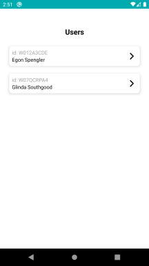
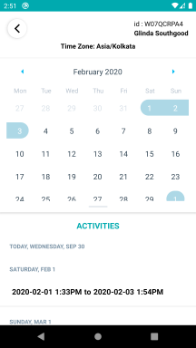

# user-activity-calendar

A React Native application that shows a list of users and time ranges during which they were active on the a day, with an option to view all the periods of
activity for different days using a calendar.

<b>Instructions to run the application</b>
* Download the code
* Assuming your system has setup for running a react native project.
* Inside the project folder execute the command: npm run android
* This will bulid the project and execute it on an emulator/connected device.

<b>Libraries used:</b>
* [react-navigation](https://github.com/react-navigation/react-navigation)
* [lodash](https://github.com/lodash/lodash)
* [react-native-calendars](https://github.com/wix/react-native-calendars)
* [react-native-vector-icons](https://github.com/oblador/react-native-vector-icons)

<b>Screens:</b>
* Home screen: shows the list of users.
* Detail screen: calendar shows the time ranges of each users activities.

<b>Data format:</b>
[Test.json](Test.json)
